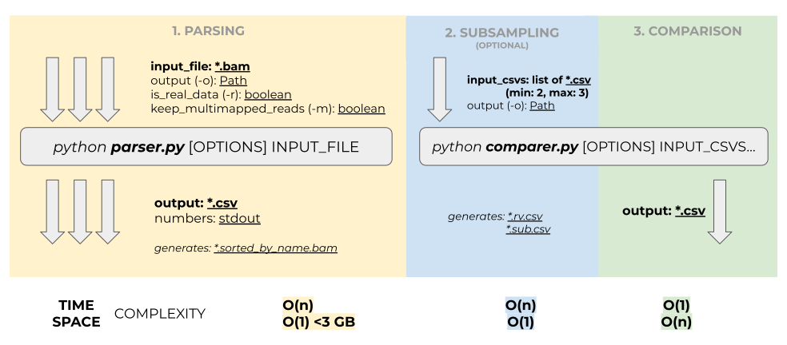

# Binary Alignment Map Files Comparer

Set of 2 Python scripts to compare alignment data among replicates.

## Installation

First, create a virtual environemnt.
Then install dependencies via pip:

```bash
pip install -r requirements.txt
```

## Pipeline



## I. BAM -> CSV

Parser `parser.py` is a command line Python application. \
To show available commands run:

```bash
python parser.py --help
```

It requires only path to the input BAM File as a sole argument. There is no need to sort and index BAM Files prior to parsing as well as to specify whether it contains paired end or single end reads. Simply run:

```bash
python parser.py <input_file.bam>
```

By default, it creates a CSV File named `parser_output.csv` in the current directory. The output can be specified by providing an absolute or relative path with `-o` option:

```bash
python parser.py -o <output_file.csv> <input_file.bam>
```

It is also recommended to provide a unique label corresponding to each replicate with `-l` option, though it is not mandatory to specify labels manually, as by default it uses name of the input file. For further comparison of replicates of different sizes flag `--real-data` or `-r` should be given.

### Output

Generated CSV File will contain only unambiguous (non-multimapped primary alignments) reads (pairs of reads) if flag `--keep-multimapped_reads` was not given.

All the supportive data (e.g. number of reads by type, output path, memory usage) is printed to the stdout.

### Time complexity

Time complexity is O(n) for the algorithm, where n is the number of reads in the BAM File.

### Space complexity

Space complexity is O(1) for the algorithm. Regardless of the replicate size, the script will use no more than 3 GB of memory at peak.

## II. Comparison

To compare previously obtained CSV files use `compare.py`, which is also a command line Python application.

To show available commands run:

```bash
python comparer.py --help
```

The data will be automatically subsampled if tables of different size are given.

During subsampling `input_file.rv.csv` and `input_file.sub.csv` will be generated (corresponding to the sorted table of reversed complemented reads and table with only common reads) for each `input_file.csv`.

To run:

```bash
python comparer.py -o <output.csv> <input_1.csv> <input_2.csv> ...
```

### Output

The generated CSV file contains a list of counters for the selected features.

Additionally, it is possible to extract any type of read fraction, such as `ID`, `CG_IL`, `IG`, `MM`, `IT1`, and `IT2`, into a separate CSV file. For example, to extract identical reads and hidden multimapped reads to the files `comparer_output.ID.csv` and `comparer_output.MM.csv` respectively, use the `--extract` or `-x` option as follows:

```bash
python comparer.py -o <output.csv> -x ID -x MM <input_1.csv> <input_2.csv> ...
```

To extract all types of reads to an individual file, use the following command:

```bash
python comparer.py -o <output.csv> -x all <input_1.csv> <input_2.csv> ...
```

The columns of the output file can be filtered. By default, output file will contain all columns for each read: `flags`, `pos`, `chr`, `CIGAR`,
`edit_dist`, `quality`, `MD`, `multi`. To extract only selected columns use option `--filter` or `-f`. For example, to retain only the columns for mapping position and edit distance, use the following command:

```bash
python comparer.py -o <output.csv> -x MM -f pos -f edit_dist <input_1.csv> <input_2.csv> ...
```

### Time complexity

Time complexity is O(n) for the subsampling process and O(1) for comparison process.

### Space complexity

Space complexity is O(1) for the subsampling process and O(n) for comparison process.
